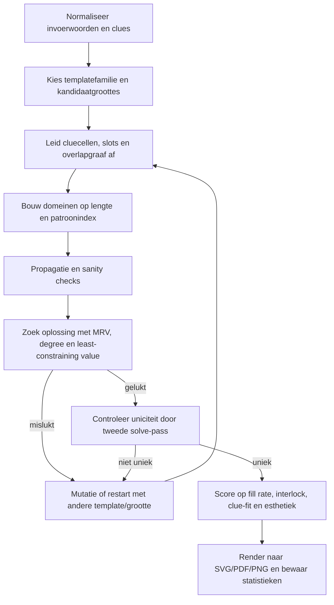

# Zweedse puzzels en algoritmen voor automatische constructie

## Executive summary

Een **Zweedse puzzel** of **Zweeds raadsel** is een kruiswoordvariant waarin de omschrijvingen niet in een aparte lijst staan, maar **in het diagram zelf** worden geplaatst, doorgaans in speciale cluecellen met **pijlen** die de invulrichting aangeven. In officiële softwaredocumentatie heet dit ook wel **“clues in squares”** of **“arrowword”**; Engelstalige puzzelgidsen noemen het daarnaast **Scandinavian crossword** of **Swedish crossword**. Nederlandse puzzelsites beschrijven hetzelfde basisprincipe: clue in het vakje, pijl naar rechts of beneden, en vaak zeer korte omschrijvingen omdat de ruimte beperkt is. citeturn36view0turn18view0turn35view0turn35view1turn16search3

Voor de **Nederlandse praktijk** zijn drie structurele kenmerken het belangrijkst. Ten eerste zijn de vakjes vaak **groter** dan in een klassieke kruiswoordpuzzel, zodat cluetekst leesbaar blijft. Ten tweede is **symmetrie meestal geen harde eis**; Nederlandse en Vlaamse beschrijvingen zeggen expliciet dat Zweedse puzzels vaak niet symmetrisch zijn. Ten derde zijn de clues meestal **zeer kort** — vaak één of twee woorden, vaak synoniemen — en in Nederlandse oplosadviesbronnen telt **IJ** als één letter. Richtingen zijn doorgaans **rechts** en **omlaag**; links, omhoog of diagonaal komen in consumentenbronnen zelden voor, al ondersteunen sommige editors die wel technisch. citeturn18view0turn36view0turn38view0turn5view0turn35view1

Voor **automatische generatie** vond ik geen publiek toegankelijke, peer-reviewed publicatie die specifiek het **volledige** genereren van Nederlandse/Scandinavische clue-in-grid-puzzels formaliseert, inclusief keuze van cluecellen, pijlen en lay-out. Wél is er een stevige literatuur over **gewone kruiswoordconstructie** via constraint satisfaction, heuristische zoekmethoden, backtracking, lokale zoekmethoden, genetische algoritmen en integer programming. Daarnaast bestaan commerciële tools die Zweedse/arrowword-puzzels automatisch genereren, maar hun publieksdocumentatie beschrijft vooral functies en outputs, niet de precieze interne optimalisatieprocedure. Een kleine open-source Zweedse generator benadrukt bovendien dat Swedish-style grids **veel dichter** zijn dan Engelstalige grids en dat bijna elke letter gedeeld wordt, wat het probleem merkbaar lastiger maakt. citeturn32view0turn23view3turn27view0turn25view0turn23view1turn23view2turn30view0turn45view0turn35view2turn9view2turn11view0

Voor **jouw use-case** — een gegeven woordenlijst met korte omschrijvingen — is de beste keuze niet een “puur” genetisch of puur willekeurig systeem, maar een **template-gestuurde hybride CSP-aanpak**: werk met een kleine bibliotheek van Zweedse lay-outtemplates of templatefamilies, leid daaruit slots af, vul die met een **constraint-solver of sterke backtracking met forward checking**, en gebruik daarna **restarts en kleine lay-outmutaties** om de beste versie te kiezen. Daarmee krijg je de beste combinatie van redactionele controle, reproduceerbaarheid, uniqueness-checks en runtime. Mijn concrete aanbeveling is daarom: **Python voor de generator-kern**, met een **slot-gebaseerd model plus cluecel-templates**, MRV/degree/least-constraining-value-heuristieken, en een tweede solve-pass om uniciteit te verifiëren. citeturn27view0turn32view0turn23view3turn14view0turn14view5turn45view0

## Wat een Zweedse puzzel is

Onder *Zweedse puzzel* versta ik hier de Nederlandse vorm van het **Zweeds raadsel**: een kruiswoordpuzzel waarbij de omschrijvingen **in het diagram** staan, op de plaats waar in een klassieke kruiswoordpuzzel meestal zwarte vakjes of andere scheidingscellen zouden zitten. Nederlandse sites als Puzzelstad en PuzzelPro beschrijven dat identiek, en de officiële handleiding van Crossword Compiler noemt dit type expliciet **clues-in-squares/arrowword puzzles**. citeturn36view0turn18view0turn35view0

De internationale terminologie is versnipperd maar consistent genoeg om relevant te zijn voor softwareontwerp. In Engelstalige puzzelgidsen komt hetzelfde genre terug als **Arroword/Arrowword**, **Scandinavian crossword** en **Swedish crossword**; Puzzler noemt het een van de populairste puzzeltypes in veel Europese landen. Dat betekent praktisch dat je bij brononderzoek en bibliotheken niet alleen op *Zweedse puzzel* of *Zweeds raadsel* moet zoeken, maar ook op **arrowword**, **clue squares**, **clues in squares** en **Scandinavian crossword**. citeturn16search3turn35view0turn35view1

De herkomst is in de publiek toegankelijke bronnen **niet helemaal netjes primair verifieerbaar**. Wat toegankelijk en consistent terugkomt in Vlaamse en Nederlandse secundaire bronnen is het verhaal dat dit type in **Scandinavië** populair werd, maar in de vorm die wij kennen waarschijnlijk **eerder Deens dan Zweeds** is, met een eerste verschijning rond **1948** of **de jaren vijftig** in het Berlingske dagblad in Kopenhagen. Omdat ik hiervoor in de toegankelijke bronnen geen goed ontsloten primaire krantenscan heb gevonden, moet dit worden gelezen als **best-reconstructed history uit betrouwbare secundaire uitleg**, niet als archiefzekerheid. citeturn38view0turn38view2

Qua varianten zijn er in de bronnen vier terugkerende families. De eerste is de **standaard clue-in-grid-variant** met alleen tekstclues. De tweede voegt een **oplossingswoord** of sleutelwoord toe via gemarkeerde lettercellen. De derde gebruikt een **illustratie of foto** in of naast het raster. De vierde is de **compacte** of schermvriendelijke online variant, die vooral in apps opduikt. Nederlandse commerciële voorbeelden van PuzzelPro tonen expliciet een gewone 10×8-versie, een 10×8-versie met oplossingswoord en een 10×17-versie met illustratie. Engelstalige en app-bronnen noemen daarnaast foto’s, spell-out-antwoorden en compactere schermlayouts. citeturn18view0turn8view0turn8view1turn38view0turn16search3turn44search4

## Regels en structurele randvoorwaarden

### Definitie van vaktypes en conventies

Een Zweedse puzzel heeft in de praktijk **niet simpelweg “witte” en “zwarte” vakjes**, maar eerder drie functionele celtypen: **lettercellen**, **cluecellen** en eventueel **harde blokcellen** of illustratie-/uitsparingscellen. De cluecel bevat korte cluetekst en een of meer pijlen; de lettercel bevat precies één letterteken; een harde blokcel is optioneel en dient alleen als extra scheiding of lay-outhulp. Nederlandse uitleg zegt expliciet dat de clues staan op de plaats van de “normaal gesproken zwarte vakjes”, wat bevestigt dat cluecellen functioneel de rol van veel blokken overnemen. citeturn36view0turn18view0turn35view0

In gepubliceerde voorbeelden zijn cluecellen vaak **visueel anders gekleurd** dan lettercellen, bijvoorbeeld grijs in plaats van wit, maar dat is een **presentatieconventie**, geen logische eis van het puzzeltype. Het echte inhoudelijke onderscheid is of een cel een letter draagt of een clue met pijlen. De PuzzelPro-voorbeelden laten bovendien zien dat cluecellen soms **gesplitst** zijn om twee clues in één vak te tonen. De officiële editorbeschrijving van Crossword Compiler bevestigt dat door expliciet te documenteren dat meerdere clues in één clue square kunnen worden ingevoerd, gescheiden door een horizontale lijn. citeturn8view0turn35view1

### Clues, richtingen en nummering

De clueplaatsing is het bepalende verschil met klassieke kruiswoordpuzzels. In plaats van genummerde clues buiten het raster heeft de Zweedse puzzel **zelflokaliserende clues**: je leest de clue in de cluecel en volgt de pijl naar het antwoord. Hersenstichting zegt hetzelfde in oplosuitleg; Puzzler benadrukt dat dit type daardoor **geen clue numbers** nodig heeft. citeturn5view0turn17search6

Voor de richting geldt in de toegankelijke Nederlandse/Vlaamse uitleg een duidelijke norm: antwoorden lopen meestal **naar rechts** of **naar beneden**. De KU Leuven-uitleg op *Ik heb een vraag* zegt expliciet dat links of omhoog zeldzaam zijn. De officiële clue-square-editor van Crossword Compiler ondersteunt wél ook diagonale pijlen en verplaatsbare pijlen, maar dat is een softwarecapabiliteit; voor een Nederlands “huisstijlgetrouwe” generator zou ik diagonalen dus als **optioneel** behandelen, niet als standaard. citeturn38view0turn35view1

Nummering is in de kern **niet nodig** voor clues, maar verschijnt soms als *meta*-mechanisme. PuzzelPro toont een variant waarin omcirkelde, genummerde lettercellen samen een oplossingswoord vormen, en Vlaamse uitleg noemt hetzelfde idee van een sleutelwoord naast de puzzel. Conclusie: **cluenummering is meestal afwezig**, maar **speciale lettercellen** voor een eindoplossing zijn een erkende variant. citeturn8view1turn38view0

### Grootte, symmetrie en leesbaarheid

Ik heb in de geraadpleegde Nederlandse bronnen **geen canonieke standaardmaat** gevonden vergelijkbaar met bijvoorbeeld de Amerikaanse 15×15. Wat wél duidelijk zichtbaar is, is dat commerciële voorbeelden variëren: PuzzelPro biedt onder meer **10×8** en **10×17**. Puzzle-Generator beschrijft de grootte zelfs als vrij instelbare parameter. Vanuit ontwerpstandpunt betekent dit dat **grid size een open parameter** is en niet als cultureel vaststaand gegeven moet worden ingebakken. citeturn18view0turn45view0

Nederlandse puzzelsites zeggen daarbij twee keer bijna hetzelfde: een Zweedse puzzel heeft **grotere vakjes** dan een klassieke kruiswoordpuzzel, om cluetekst leesbaar te houden. Dat is niet cosmetisch maar architectonisch: celgrootte beïnvloedt direct hoeveel cluekarakters en hoeveel regels je in een cluecel kwijt kunt. De clue-square-documentatie van Crossword Compiler maakt daarom ook melding van font scaling, woordafbreking en meerdere regels per clue square. citeturn18view0turn36view0turn35view1

Symmetrie is een ander belangrijk verschil met veel klassieke krantenkruiswoorden. Puzzelstad stelt expliciet dat een Zweedse puzzel **vrijwel nooit symmetrisch** is opgebouwd; een Vlaamse vergelijking tussen Zweedse puzzels en klassieke kruiswoordraadsels maakt hetzelfde punt. Voor jouw generator betekent dat iets eenvoudigs maar belangrijks: **symmetry should be optional, not default**. Voor Nederlandstalige Zweedse puzzels zou ik redactioneel standaardiseren op **asymmetrisch**, met alleen optionele symmetrie als vormgevingskeuze voor een specifieke klant. citeturn36view0turn38view2

### Taaltechnische bijzonderheden

Vanuit Nederlands perspectief is de **IJ-regel** cruciaal. Hersenstichting zegt expliciet dat de combinatie **IJ als één letter** telt in een Zweedse puzzel. Voor een generator betekent dat dat je intern met een **atoomteken** moet kunnen werken voor IJ, in plaats van blind op Unicode-codepoints of stringlengte te vertrouwen. Doe je dat niet, dan rekent je slotlengte verkeerd, vallen woorden af die eigenlijk passen, en worden oplossingen voor Nederlandse spelers inconsistent met de gebruikelijke conventie. citeturn5view0

Daarnaast leggen meerdere bronnen uit waarom clues vaak **kort en synoniemachtig** zijn: er is eenvoudig weinig ruimte in een cluecel. Dat lijkt triviaal, maar algoritmisch is het belangrijk omdat het betekent dat jouw pipeline voor clue-inname **geen lange cryptische clueparsing** hoeft te ondersteunen. Jouw use-case — woordenlijst plus korte omschrijving — sluit dus juist goed aan op het Zweedse format. citeturn36view0turn38view0turn18view0

### Bronvoorbeelden en een schematische layout

Twee bronvoorbeelden zijn voor ontwerpdoeleinden bijzonder nuttig. Het eerste is PuzzelPro’s 10×8-voorbeeld, dat laat zien hoe cluecellen, pijlen en relatief grote lettervelden samenkomen in een typisch Nederlands raster. Het tweede is de officiële Crossword Compiler-documentatie voor clue squares, die de editorlogica achter gesplitste cluecellen, meerdere regels en meerdere pijlen uitlegt. Samen geven die een goede normatieve basis voor een generator die “redactioneel geloofwaardig” moet ogen. citeturn8view0turn18view0turn35view1

Onderstaande mermaid-schets is **geen facsimile van een bronafbeelding**, maar een schematische afleiding van precies die bronconventies: een cluecel kan één of twee clues bevatten, pijlen wijzen meestal rechts/omlaag, en de lettercellen lopen door tot ze door een nieuwe cluecel of scheidingscel worden onderbroken. citeturn8view0turn35view1turn36view0

```mermaid
flowchart TB
  subgraph rij1["rij 1"]
    a["cluecel\nzoogdier →\n—\nrivier ↓"] --- b["L"] --- c["A"] --- d["M"]
  end
  subgraph rij2["rij 2"]
    e["E"] --- f[""] --- g[""] --- h[""]
  end
  subgraph rij3["rij 3"]
    i["E"] --- j[""] --- k["cluecel\nplaats →"] --- l["S"]
  end
  subgraph rij4["rij 4"]
    m["K"] --- n[""] --- o[""] --- p["T"]
  end
```

## Algoritmen en bestaande tools

### Wat de literatuur wél en niet laat zien

De academische literatuur over kruiswoordconstructie is verrassend rijk, maar ze gaat meestal over **klassieke** kruiswoordpuzzels met een gegeven blokpatroon of een nog te bepalen diagram. De standaardmodellen zijn **constraint satisfaction** en **heuristische zoekmethoden**. Reeds in 1990 stelden Ginsberg en collega’s dat brute-force search al snel onpraktisch wordt en dat je keuzes moet maken over variabelevolgorde, waardeselectie, backtracking en preprocessing. Beacham en collega’s trekken later een algemenere les: model, algoritme en heuristiek zijn **onderling afhankelijk**, en suboptimale combinaties kunnen ordes van grootte schelen in performance. citeturn27view0turn27view1

Meer recente CSP- en hybride papers laten een vrij stabiel patroon zien. Botea’s hiërarchische CSP-encoding gebruikt op hoog niveau **slotvariabelen** en op laag niveau **celvariabelen**, waarbij channeling constraints het zoekruim reduceren. Anbulagan en Botea laten in 2008 zien dat een **hybride model** met cel- en slotviewpoints en nogood learning goed werkt en dat de moeilijkheid sterk afhangt van onder meer **woordenboekgrootte** en het aantal **geblokkeerde cellen**. Dat is voor jouw probleem heel relevant, omdat Zweedse puzzels in feite een nog complexer diagramprobleem toevoegen: cluecellen vervangen een deel van de blokstructuur. citeturn32view0turn23view3turn28view0turn28view2turn28view3

Voor het **onbegrensde** probleem — woorden gegeven, gridvorm nog niet volledig vast — laat de paper van Agarwal en Joshi zien dat je meerdere strategische functies nodig hebt: woordselectie, woordplaatsing, grid resizing, grid reshaping en desnoods clue generation. Zij rapporteren dat hun gecombineerde strategieën snel goed gevulde puzzels opleveren en empirisch ongeveer lineair opschalen met het aantal woorden in hun experimenten. Dat maakt hun werk bijzonder bruikbaar als denkmodel voor Zweedse puzzels, ook al is het geen specifiek arrowword-paper. citeturn24view0

### Vergelijking van algoritmefamilies

| Algoritmefamilie | Kernidee | Sterktes | Zwaktes | Geschiktheid voor Zweedse puzzels |
|---|---|---|---|---|
| Exacte CSP met slotvariabelen | Elk slot is een variabele; domein = woorden van juiste lengte; intersecties zijn constraints | Exact, goed te combineren met arc consistency, uniqueness-checks mogelijk; literaturaal goed onderbouwd citeturn30view2turn32view0turn23view3 | Bij vrije lay-out explodeert de zoekruimte; cluecellen/pijlen moet je apart modelleren | **Goed** als de lay-out of template grotendeels vastligt |
| Hiërarchische of hybride CSP | Zowel slots als cellen zijn variabelen; channeling reduceert search | Sterke propagatie; beter voor moeilijke grids en deadlockdetectie citeturn32view0turn28view0turn28view4 | Complexer model en implementatie | **Zeer goed** voor Zweedse puzzels met hoge interlock |
| Backtracking met heuristieken | Kies moeilijkste slot eerst; probeer woorden met minste schade | Eenvoudig, transparant, goed te tweaken; veel klassieke kennis beschikbaar citeturn27view0turn25view0 | Zonder goede domeinindexering en pruning snel traag | **Goed** voor een eerste productierijpe versie |
| Checkpoint/backjumping-zoeking | Niet altijd naar ouder knooppunt terug, maar naar gunstige checkpoints | Praktisch nuttig in echte productie; ondersteunt moeilijkheidscontrole via woordenboekcategorieën citeturn25view0 | Meer toestand en bookkeeping | **Goed** als je veel puzzels in batch wilt genereren |
| Integer programming / CP-SAT / MILP | Binaire of integer variabelen kiezen woord-slottoewijzing en soms layout | Erg geschikt als je meerdere kwaliteitsdoelen wilt optimaliseren; uniciteit en objective waarde formeel te sturen citeturn30view0turn30view1turn14view0 | Groot model; vrije cluecellay-out is zwaar; modeling effort hoog | **Goed** voor vaste templates en kwaliteitsoptimalisatie |
| Exact cover / DLX | Reductie naar exact-cover-matrix en depth-first enumeratie | Zeer elegant en snel voor vaste combinatorische structuren; Knuths DLX is efficiënt voor sparse matrices citeturn33search0turn33search2turn33search5 | Minder natuurlijk voor zachte doelen zoals esthetiek, clue-fit en layoutmutaties | **Redelijk** voor vaste candidate layouts; minder voor de hele Zweedse puzzelketen |
| Simulated annealing / lokale zoeking | Start met kandidaatgrid en verbeter via mutaties | Goed voor open design space, layoutverbetering en multi-objective scoring citeturn23view2turn19search18 | Moeilijker om hard guarantees te geven; uniciteit niet vanzelf | **Goed als tweede fase**, niet als enige methode |
| Genetische algoritmen | Evolueer populatie van grids of lettermatrices | Flexibel voor globale zoektocht en esthetische scorefuncties citeturn20search2turn23view1 | Encoding en fitnessontwerp zijn lastig; vaak veel evaluaties nodig | **Nuttig voor research of large search**, maar zelden de beste MVP |
| Greedy constructive + restart | Plaats iteratief woorden die passen; herstart vaak | Snel te bouwen; bruikbaar voor prototypes en educatieve tools citeturn11view0turn24view0 | Kan makkelijk vastlopen of lage kwaliteit opleveren | **Acceptabel als baseline**, onvoldoende voor productie zonder reparatiestap |

### Bestaande tools en wat ze impliciet zeggen

Er zijn verschillende gereedschappen die jouw probleemgebied raken, maar ze verschillen sterk in transparantie. De officiële documentatie van **Crossword Compiler** ondersteunt expliciet **clues-in-squares/arrowword**-puzzels, heeft een clue-square-editor met meerdere clues, pijlen en automatische cluegeneratie, en ondersteunt daarnaast automatische grid filling voor vocabulaire- en themapuzzels. **Puzzle-Generator** adverteert expliciet met **Swedish-style crosswords**, import van eigen woorden/clues, automatische grid filling, layoutcontrole, exportformaten en **generation statistics** zoals fill rate. Beide zijn dus functioneel relevant, maar publiceren in hun toegankelijke documentatie niet het exacte zoekalgoritme. citeturn35view0turn35view1turn35view2turn35view3turn45view0

Daarnaast zijn er open-source of semi-open-source projecten die nuttige signalen geven. Het Zweedse project **ahrnbom/swedishstyle** zegt expliciet dat Swedish-style crosswords **veel dichter** zijn dan veel Engelstalige crosswords en dat bijna elke letter door meerdere woorden gedeeld wordt. De meegeleverde code gebruikt een eenvoudige **greedy/intersection-based methode met random choice en herhaalde pogingen**, wat vooral laat zien hoe moeilijk het probleem is: de auteur noemt het zelf nog niet volwassen. Er bestaan ook webtools als **crossword-studio** voor swedish-style crosswords, maar zonder sterke publieke technische documentatie. citeturn9view2turn11view0turn44search15

| Tool | Relevantie voor jouw case | Wat publiek gedocumenteerd is | Beoordeling |
|---|---|---|---|
| Crossword Compiler | Professionele clue-in-grid/arrowword editor, publishing, auto-cluing en grid-filling citeturn35view0turn35view1turn35view2 | Zeer rijk qua features; exacte solver niet publiek uitgelegd | Goed als referentie voor UX en export, minder als algoritmische blauwdruk |
| Puzzle-Generator | Expliciete ondersteuning voor Swedish-style crosswords uit woordlijsten met automatische filling en metriekweergave citeturn45view0 | Beschrijft “optimized algorithms”, fill rate, layoutcontrole, import/export; geen formele methode | Sterke productbenchmark, beperkte wetenschappelijke transparantie |
| ahrnbom/swedishstyle | Open-source Zweedse proof-of-concept citeturn9view2turn11view0 | Code laat random-greedy intersectieplaatsing zien | Nuttig als minimale baseline, niet voldoende als eindarchitectuur |
| Qxw | Sterke klassieke crossword- en grid-exploratiefeatures; veel symmetrie- en filling-opties in publieksbeschrijving citeturn44search5 | Breed, maar niet specifiek voor clue-in-grid-puzzels in de toegankelijke snippet | Interessant voor klassieke grid research |
| Exet / Phil / CrossFire | Vooral klassieke crosswords en redactionele workflows citeturn34search0turn34search2turn34search7turn34search19 | Goede constructietools; niet specifiek op Zweedse cluecellen gericht | Bruikbaar als referentie voor interface- en editingconcepten |

## Aanbevolen ontwerp voor jouw use-case

### Waarom dit de beste strategie is

Voor jouw probleem — **gegeven woordenlijst plus korte clueteksten**, maar **geen vaste gridgrootte, moeilijkheid of dichtheid** — raad ik een **template-gestuurde hybride CSP-aanpak met multi-start en lokale layoutmutaties** aan. De reden is eenvoudig. Een volledig vrije layoutzoektocht met cluecellen, pijlen en woorden tegelijk is combinatorisch zwaar; dat blijkt al uit de algemene unconstrained-literatuur. Tegelijk wil je meer kwaliteit en controle dan een random-greedy prototype of een puur evolutionair systeem meestal biedt. De middenweg is daarom het sterkst: begin met een bibliotheek van redactioneel plausibele Zweedse templates, vul die exact of bijna exact met CSP/backtracking/CP-SAT, en gebruik mutaties of restarts wanneer een template niet goed past. citeturn24view0turn27view0turn32view0turn23view3turn45view0

Die keuze sluit ook aan op de **culturele eigenschappen** van Zweedse puzzels. Nederlandse bronnen laten zien dat symmetrie niet centraal staat, cluecellen de blokstructuur vervangen, clueteksten kort zijn en gridmaten variëren. Dat maakt templatefamilies extra effectief: je hoeft niet eerst “de perfecte universele Zweedse grammatica” te vinden, maar kunt vanuit een handvol layoutfamilies al betrouwbaar genereren. Denk aan families als **compact 10×8**, **vierkant 10×10 of 11×11**, **langwerpig 10×17 met illustratie**, elk met een cluecelratio en interlockdoel die redactioneel past bij het beoogde gebruik. citeturn18view0turn36view0turn38view0turn45view0

### Data-structuren

Ik zou de generator opbouwen rond zeven kernstructuren.

**GridCell** is de basiseenheid en heeft een type uit `{LETTER, CLUE, BLOCK, IMAGE}`. Voor `CLUE` bevat de cel een lijst van clue-items, elk met `direction`, `text`, `lineIndex`, `arrowAnchor` en een verwijzing naar het doelslot. Dit sluit direct aan op de idee van officiële clue squares met meerdere regels en meerdere pijlen. citeturn35view1

**Slot** representeert een antwoordreeks in één richting. Een slot heeft geen extern nummer nodig maar een sleutel als `(originRow, originCol, direction)`. Het bevat `cells[]`, `length`, `intersections[]`, `wordId?`, `clueText`, en eventueel een `difficultyWeight`. In CSP-termen is dit je hoofvariabele, precies zoals de academische CSP-modellen sloten als variabelen gebruiken. citeturn30view2turn32view0turn23view3

**WordEntry** heeft `answer`, `normalizedAnswer`, `tokens`, `clue`, `length`, `rarity`, `themeTags` en eventueel `publisherFlags`. Voor Nederlands moet `tokens` **IJ als atomair symbool** kunnen opslaan wanneer de doelgroep die conventie verwacht. citeturn5view0

**DomainIndex** bevat ten minste:
- index op lengte;
- index op `(positie, letter)` voor snelle pattern-matching;
- optioneel index op letterfrequentie of woordfrequentie.

Dit soort preprocessing ligt in lijn met de klassieke crossword-literatuur, waar domeinreductie en pattern matching cruciaal zijn voor performance. citeturn27view0turn25view0

**IntersectionGraph** is een graaf waarin elke node een slot is en elke edge een overlap `(slotA, posA, slotB, posB)` representeert. Dit is nuttig voor heuristieken zoals degree, connectedness en latere kwaliteitsmetrieken. Zowel in Python als TypeScript bestaan hiervoor geschikte graafbibliotheken. citeturn41search2turn43view0

**Template** beschrijft alleen de structuur: gridgrootte, vaste cluecellen, optionele blokken, eventuele illustratiezone, en toegestane mutaties. Dit is de sleutel tot redactionele consistentie.

**CandidateSolution** bundelt een concrete gevulde template plus scores voor fill rate, interlock, uniciteit, clue-fit en esthetiek.

### Constraint-modellering

Voor een template met afgeleide slots kun je de kernconstraints als volgt formuleren.

Voor elk slot `s` kies je **exact één woord** uit zijn domein. Voor elk woord `w` mag in de basis **hoogstens één slot** dezelfde invoer gebruiken, tenzij je bewust duplicaten toestaat voor speciale themapuzzels. Intersectieconstraints eisen dat overlappende letters gelijk zijn. Dat is de standaard slot-CSP en volledig in lijn met de klassieke modellen en de CS50-educatieve projectstructuur. citeturn30view2turn30view3turn32view0

Voor een Zweedse puzzel voeg je daar **diagramconstraints** aan toe:
- elke `CLUE`-pijl moet precies één bestaand slot aanwijzen;
- een `right`-pijl impliceert dat de cel rechts ernaast een `LETTER`-cel is en het slot daar start;
- een `down`-pijl impliceert hetzelfde voor de cel eronder;
- een scheidingslijn binnen een cluecel mag alleen als er daadwerkelijk twee clue-items zijn;
- pijlen zijn alleen zichtbaar als er een corresponderend slot bestaat, precies zoals de officiële editordocumentatie aangeeft. citeturn35view1

Voor **zachtere doelen** kun je een gewogen score gebruiken:
- maximaliseer het aantal geplaatste woorden;
- maximaliseer interlock;
- minimaliseer lege/ongebruikte letterruimte;
- penaliseer overspannen cluecellen;
- penaliseer zwakke of triviale snijpunten;
- penaliseer asymmetrie alleen als symmetrie gewenst is.

Dit is precies het soort multi-criteria optimalisatie waarvoor CP-SAT of MILP aantrekkelijk wordt. Puzzle-Generator laat ook zien dat zo’n productiestroom in de praktijk zinvol is door na generatie statistics zoals fill rate te tonen. citeturn14view0turn45view0

### Volgordeheuristieken

De literatuur is opvallend eensgezind dat **welk slot je eerst kiest** enorm uitmaakt. De klassieke keuze is **MRV**: vul eerst het slot met het kleinste resterende domein. Ginsberg besprak al de goedkoopst-eerst-heuristiek en dynamische search rearrangement; Arbiser kiest expliciet het patroon met de **laagste score**, dus het lastigst te vullen patroon. Botea gebruikt eveneens een variant van “most constrained” op slotniveau. citeturn27view0turn25view0turn32view0

Voor jouw generator zou ik deze samengestelde slotscore gebruiken:

\[
priority(s)=
\alpha \cdot \frac{1}{|D(s)|}
+\beta \cdot degree(s)
+\gamma \cdot length(s)
+\delta \cdot startsRareLetters(s)
+\epsilon \cdot clueCellPressure(s)
\]

waar `clueCellPressure` hoger is wanneer de omringende clue-layout weinig alternatieven overlaat. Deze score is geen literatuurcitaat maar een praktische synthese van de genoemde heuristische families. De waarde-orde binnen een domein kies je vervolgens met **least-constraining value**: probeer eerst het woord dat de domeinen van kruisslots het minst verkleint. Dat sluit direct aan op Ginsbergs aanbeveling om woorden te kiezen die volgende keuzes zo weinig mogelijk beperken. citeturn27view0

### Cluecellen, blokken en patroonbehandeling

In een klassieke crosswordgenerator zijn zwarte blokken het primaire scheidingsmechanisme. In een Zweedse puzzel is dat anders: de cluecel **is zelf** het begin van een of meer woorden. Daarom raad ik aan blokken als **secundair** te modelleren. Gebruik ze alleen:
- aan vaste illustratieranden;
- bij marges of druktechnische beperkingen;
- om onoplosbare of lelijke reststructuren te breken;
- of wanneer je bewust een compact of thematisch patroon wilt. citeturn18view0turn35view1

Voor patroonfamilies zou ik beginnen met drie templatesets:
- **compact** met relatief meer cluecellen en korte antwoorden;
- **gebalanceerd** met veel kruisingen en vrijwel geen harde blokken;
- **feature** met illustratie- of sleutelwoordzone.

Omdat Nederlandse bronnen expliciet aangeven dat Zweedse puzzels gewoonlijk **niet symmetrisch** zijn, zou ik symmetrie standaard uitzetten. Als een opdrachtgever visuele balans wil, kun je beter werken met **lokale balansregels** dan met harde 180°-rotatie: vergelijkbaar cluecelgewicht per kwart, geen overconcentratie van korte woorden in één hoek, en een redelijk gelijkmatige verdeling van startpunten. citeturn36view0turn38view2

### Fill rate, interlock en kwaliteitsmetrieken

Ik zou voor productie niet alleen “oplosbaar of niet” meten, maar een helder kwaliteitsdashboard bijhouden.

| Metriek | Definitie | Waarom relevant | Praktisch doel |
|---|---|---|---|
| Fill rate | `# lettercellen / # alle cellen` | Commerciële tools rapporteren dit expliciet; te laag oogt leeg, te hoog drukt cluecellen weg citeturn45view0 | Als ontwerpdoel: ongeveer 0,65–0,80 voor compacte Zweedse puzzels |
| Cluecelratio | `# cluecellen / # alle cellen` | Zweedse puzzels hebben clue-in-grid, dus dit is een primaire vormparameter | Als ontwerpdoel: ongeveer 0,15–0,30 |
| Interlock ratio | `# lettercellen die in 2 slots zitten / # lettercellen` | Swedish-style grids zijn juist dicht en sterk gekruist citeturn9view2turn44search10 | Als ontwerpdoel: > 0,85, liefst richting 0,95 |
| Unused words | invoerwoorden die niet geplaatst zijn | Vooral relevant bij open gridgrootte en templatekeuze | 0 bij vaste set; anders zo laag mogelijk |
| Uniqueness | aantal complete oplossingen van het fill-model | Nodig voor redactionele betrouwbaarheid | exact 1 |
| Clue-fit | overschrijdings- of compressiescore per cluecel | Te lange cluetekst schaadt leesbaarheid | 0 overschrijdingen |
| Solvability support | gemiddelde kruisingen per woord en per letter | Meer crossings maken voortgang voor de oplosser makkelijker citeturn5view0turn44search10 | hoog genoeg om geen geïsoleerde hoeken te hebben |

Belangrijk is dat **uniciteit in twee lagen** bestaat. Een grid kan uniek zijn gegeven alleen de woordenlijst, maar nog steeds ambigu aanvoelen voor een mens als clues te generiek zijn. Daarom zou ik minstens twee checks doen:
- **structurele uniciteit**: bestaat er exact één toewijzing van woorden aan slots?
- **clue-onderscheidend vermogen**: heeft een clue niet te veel synonieme alternatieven binnen jouw interne lexicon?

De eerste kun je exact testen door een tweede oplossing te laten zoeken; OR-Tools documenteert expliciet hoe je alle oplossingen kunt enumereren. De tweede is semantischer en vaak deels redactioneel. citeturn14view0

### Aanbevolen workflow



### Pseudocode van de gekozen aanpak

```text
function generate_swedish_puzzle(word_entries, template_catalog, params):
    normalized_words = normalize_words(word_entries, ij_mode=params.ij_as_single_letter)

    best = None

    for template in select_templates(template_catalog, params):
        slots, clue_cells, overlap_graph = derive_slots(template)

        domains = initialize_domains(slots, normalized_words)
        if not basic_feasibility(domains, slots, clue_cells):
            continue

        propagate(domains, overlap_graph)

        assignment = search(
            slots=slots,
            domains=domains,
            choose_slot=most_constrained_then_high_degree,
            order_values=least_constraining_value,
            forward_check=True,
            checkpoint_backtracking=True,
            restart_budget=params.restart_budget
        )

        if assignment is None:
            for mutated_template in mutate_template(template, params):
                retry same pipeline
            continue

        if not is_unique_solution(slots, domains, assignment):
            continue

        candidate = materialize(template, assignment)
        candidate.score = evaluate(candidate, params.quality_weights)

        if best is None or candidate.score > best.score:
            best = candidate

    return best
```

### Complexiteitsanalyse

De onderliggende moeilijkheid blijft in de kern **NP-compleet**; de literatuur over unconstrained generation benadrukt precies dat de vrije keuze van gridgeometrie de complexiteit nog verder vergroot. In het slechtste geval is slotvulling dus exponentieel in het aantal slots of in de productgrootte van de domeinen. Daarom zijn heuristieken, propagatie en restarts geen “extra’s” maar basisbehoeften. citeturn24view0turn27view0

Voor de gekozen hybride aanpak kun je de runtime grofweg zien als:

\[
O(T \cdot M \cdot Search(S, D))
\]

waar `T` het aantal templates is, `M` het aantal mutaties/restarts per template, `S` het aantal slots en `D` de gemiddelde domeingrootte. Met goede indexering is domeinopbouw ongeveer lineair in de totale woordenlijstlengte; de dure stap blijft de combinatorische zoeking. De winst zit dus in: kleine domeinen, sterke overlap-indexen, goede slotvolgorde, en parallelisatie over templates. De recentere CSP-paper uit 2025 noemt preprocessing, dictionary organization, heuristics, constraint propagation en parallel processing terecht als centrale optimalisatietechnieken. citeturn23view4turn27view0turn25view0

## Implementatierichtlijnen en taalkeuze

### Python versus TypeScript

Voor de **generator-kern** raad ik **Python** aan. De reden is niet dat TypeScript ongeschikt is, maar dat Python voor dit specifieke probleem simpelweg een veel rijker ecosysteem heeft voor **constraint programming**, **optimization modeling**, **data-analyse** en **rendering**. OR-Tools documenteert CP-SAT breed in Python; `python-constraint` biedt een eenvoudige CSP-interface; Pyomo en PuLP dekken lineaire en mixed-integer modellen; NetworkX helpt bij overlapgrafen; Pillow of SVG-rendering dekken output. citeturn14view0turn14view5turn41search0turn41search1turn41search2turn41search11

TypeScript heeft óók nuttige bouwstenen, maar het solverlandschap is dunner. Microsofts Z3-guide zegt expliciet dat de JavaScript/TypeScript-bindingen bestaan, maar **nog niet alle features** van Z3 ondersteunen. Voor MIP/MILP zijn er bruikbare opties als `glpk.js` en `javascript-lp-solver`, en voor de structuurlaag zijn `graphology` of `graphlib` prima. Voor rendering is SVG.js aantrekkelijk. Maar zodra je zware constraint propagation, meerdere exacte solve-passes en batchgeneratie wilt, is het Python-ecosysteem eenvoudiger, rijper en vaak sneller in ontwikkeltijd. citeturn15view0turn14view3turn13search1turn43view0turn43view1turn42search0

Mijn nuchtere aanbeveling is daarom: **Python voor generatie en validatie; TypeScript alleen voor een optionele editor/preview in de browser**. Dat is de combinatie met de laagste technische risico’s en de hoogste iteratiesnelheid. citeturn14view0turn15view0turn41search1turn43view0

### Vergelijking van bibliotheekopties

| Taal | Bibliotheek | Rol | Opmerking |
|---|---|---|---|
| Python | OR-Tools CP-SAT | Exacte constraint solving en uniqueness-checks | Officiële CP-SAT-tooling; integer-georiënteerd; geschikt voor enumeratie citeturn14view0turn12search8 |
| Python | python-constraint | Snelle CSP-prototypes | Eenvoudig API, goed voor MVP’s en kleinere modellen citeturn14view5 |
| Python | PuLP / Pyomo | MILP/optimalisatiemodellen | Handig als je veel zachte doelen in een objective wilt gieten citeturn41search0turn41search1 |
| Python | NetworkX | Overlap- en templategrafen | Handig voor heuristieken en metrics op het slotnetwerk citeturn41search2 |
| Python | Pillow of SVG-export | PNG/SVG/PDF-output | Praktisch voor print- en webexport citeturn41search11turn45view0 |
| TypeScript | z3-solver | SMT/constraint solving | Bestaat, maar Microsoft meldt featurebeperkingen in JS/TS-bindings citeturn15view0turn12search0 |
| TypeScript | glpk.js | LP/MILP in Node/browser | Bruikbaar voor compacte optimalisatieproblemen citeturn14view3 |
| TypeScript | javascript-lp-solver | LP/MIP-modeling | Lichtgewicht, maar minder rijk solverecosysteem dan Python citeturn13search1 |
| TypeScript | graphology / graphlib | Graafdata en traversals | Goed voor overlapgraphs, template-analyse en editorlogica citeturn43view0turn42search0 |
| TypeScript | SVG.js | Client-side rendering van raster en pijlen | Erg geschikt voor interactieve editor/preview citeturn43view1 |

### Minimale architectuurschets in Python

De onderstaande outline is bewust **geen volledige implementatie**, maar geeft de minimaal nuttige interfaces.

```python
from dataclasses import dataclass
from enum import Enum
from typing import Literal, Optional

class CellType(Enum):
    LETTER = "letter"
    CLUE = "clue"
    BLOCK = "block"
    IMAGE = "image"

Direction = Literal["right", "down"]

@dataclass
class WordEntry:
    answer: str
    clue: str
    normalized: str
    length: int
    rarity: float = 0.0

@dataclass
class ClueItem:
    direction: Direction
    text: str
    slot_id: str

@dataclass
class GridCell:
    row: int
    col: int
    type: CellType
    clue_items: list[ClueItem]

@dataclass
class Slot:
    id: str
    direction: Direction
    cells: list[tuple[int, int]]
    length: int
    clue_origin: tuple[int, int]
    assigned_word_id: Optional[str] = None

class Template:
    def derive_slots(self) -> tuple[list[Slot], dict[tuple[str, str], tuple[int, int]]]:
        ...

class DomainIndex:
    def candidates_for_slot(self, slot: Slot, fixed_letters: dict[int, str]) -> list[int]:
        ...

class Generator:
    def normalize_words(self, entries: list[WordEntry], ij_as_single_letter: bool = True) -> list[WordEntry]:
        ...
    def propagate(self, slots, overlaps, domains) -> None:
        ...
    def solve(self, slots, overlaps, domains) -> dict[str, int] | None:
        ...
    def check_unique(self, slots, overlaps, assignment) -> bool:
        ...
    def render_svg(self, template, assignment, out_path: str) -> None:
        ...
```

### Minimale architectuurschets in TypeScript

Ook hier alleen de kerninterfaces.

```typescript
type Direction = "right" | "down";

enum CellType {
  LETTER = "letter",
  CLUE = "clue",
  BLOCK = "block",
  IMAGE = "image",
}

interface WordEntry {
  answer: string;
  clue: string;
  normalized: string;
  length: number;
  rarity?: number;
}

interface ClueItem {
  direction: Direction;
  text: string;
  slotId: string;
}

interface GridCell {
  row: number;
  col: number;
  type: CellType;
  clueItems: ClueItem[];
}

interface Slot {
  id: string;
  direction: Direction;
  cells: Array<[number, number]>;
  length: number;
  clueOrigin: [number, number];
  assignedWordId?: string;
}

interface Overlap {
  aSlotId: string;
  aIndex: number;
  bSlotId: string;
  bIndex: number;
}

interface Template {
  deriveSlots(): { slots: Slot[]; overlaps: Overlap[] };
}

interface DomainIndex {
  candidatesForSlot(slot: Slot, fixedLetters: Map<number, string>): number[];
}

class SwedishPuzzleGenerator {
  normalizeWords(entries: WordEntry[], ijAsSingleLetter = true): WordEntry[] {
    return entries;
  }

  propagate(slots: Slot[], overlaps: Overlap[], domains: Map<string, number[]>): void {
    // forward checking / arc-like pruning
  }

  solve(slots: Slot[], overlaps: Overlap[], domains: Map<string, number[]>): Map<string, number> | null {
    return null;
  }

  checkUnique(assignment: Map<string, number>): boolean {
    return true;
  }

  renderSvg(cells: GridCell[], outSelector: string): void {
    // ideal for SVG.js in browser
  }
}
```

## Teststrategie en open vragen

### Testgevallen die ik minimaal zou automatiseren

| Test | Doel | Verwachte uitkomst |
|---|---|---|
| Korte basispuzzel met vaste template | Verifieert slotafleiding, overlaplogica en rendu | Exact één oplossing |
| Onmogelijke woordenlijst | Verifieert correcte UNSAT-afhandeling | Geen output, duidelijke foutreden |
| Twee mogelijke fills | Verifieert uniqueness-check | Generator verwerpt of markeert kandidaat |
| Nederlands woord met `IJ` | Verifieert taalnormalisatie | Lengte telt correct conform puzzelconventie citeturn5view0 |
| Cluecel met twee clues | Verifieert separatorlogica en arrow mapping | Beide slots correct gekoppeld citeturn35view1turn8view0 |
| Template-mutatie na dead end | Verifieert restartstrategie | Nieuwe kandidaat kan alsnog slagen |
| Grootte-parameter open | Verifieert automatisch kiezen tussen 10×8, 10×10, 10×17-achtige families | Beste score wint, niet per se kleinste grid citeturn18view0turn45view0 |
| Moeilijkheidsprofielen | Verifieert woordselectie op zeldzaamheid/frequentie | “Makkelijk” bevat frequentere woorden; “moeilijk” kan zeldzamere woorden toelaten citeturn25view0 |

### Open vragen en beperkingen

De grootste inhoudelijke beperking in dit dossier is historisch en genrespecifiek. Ik vond **geen goed toegankelijke primaire bron** die de vaak genoemde herkomst uit Berlingske/Kopenhagen rechtstreeks onderbouwt, en ook **geen openbaar peer-reviewed paper** die specifiek de **volledige generatie van Zweedse clue-in-grid-puzzels** behandelt zoals Nederlandse uitgevers die publiceren. De meest specifieke publieke technische bronnen zijn daarom een combinatie van klassieke crossword-CSP-literatuur, commerciële tooldocumentatie en kleine open-source projecten. citeturn38view0turn38view2turn32view0turn23view3turn45view0turn9view2

Daaruit volgt ook de belangrijkste ontwerpconclusie: voor jouw case is het verstandig om **niet** te wachten op een “definitief wetenschappelijk Zweedse-puzzelalgoritme”, maar om een **hybride, template-gestuurde solverarchitectuur** te bouwen. Dat is het best onderbouwde compromis tussen de echte genre-eisen van Nederlandse Zweedse puzzels en de algoritmische techniek die de literatuur daadwerkelijk ondersteunt. citeturn27view1turn24view0turn32view0turn14view0